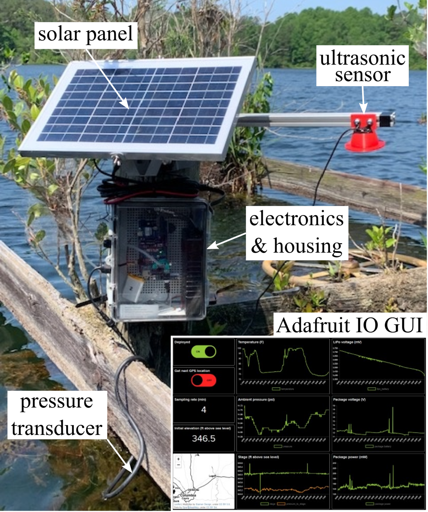

# IoT-Water-Level-Sensor
IoT Water Level Sensor

This is a stage sensor developed by the ARTS-Lab at the University of South Carolina and interns at the South Carolina Department of Health and Environmental Control (SC DHEC) Dam Safety Program. The purpose of this sensor is to provide a low-cost, open-source alternative to traditional gaging equipment. 

Figure 1: Sensor deployed on the primary spillway of a dam transmitting data to the GUI.

## System Development
Contains the hardware and software developed for the project. 

## Licensing and Citation

This work is licensed under a Creative Commons Attribution-ShareAlike 4.0 International License [cc-by-sa 4.0].

Cite this as: 

@Misc{ARTSLabIotWaterLevel,    
  author = {ARTS-Lab},  
  howpublished = {GitHub},  
  title  = {IoT Water Level Sensor},   
  groups = {ARTS-Lab},    
  url    = {https://github.com/ARTS-Laboratory/IoT-Water-Level-Sensor},   
}

